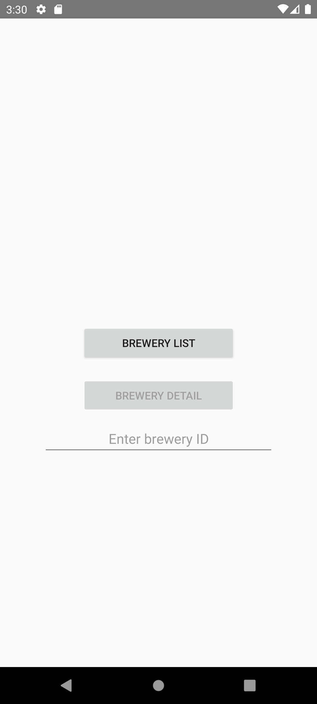
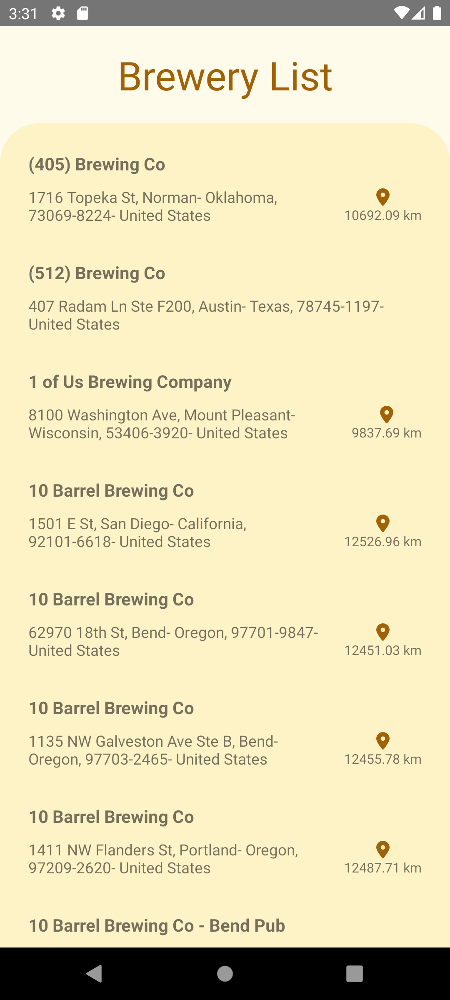
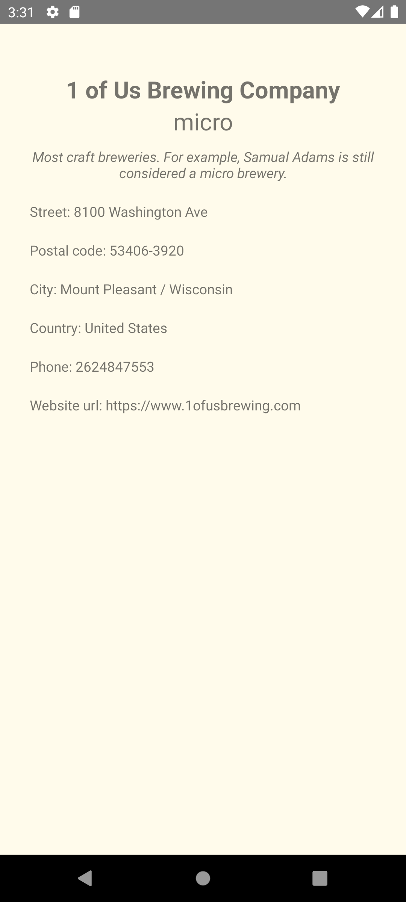

# OpenBrewery-Android
Repository created to develop an Android app that shows Open Brewery API content openbrewerydb.org

## Features

<p align="center" width="100%">
    
</p>

### Brewery Home

<p align="center" width="100%">
    
</p>

### Brewery List

<p align="center" width="100%">
    
</p>

The results shown at brewery list is gotten from https://api.openbrewerydb.org/v1/breweries/ 
through GET HTTP request. This API returns a brewery list in a JSON array and the application is 
responsible for converting the data into a readable one. Example:

```json
[
  {
    "id": "5128df48-79fc-4f0f-8b52-d06be54d0cec",
    "name": "(405) Brewing Co",
    "brewery_type": "micro",
    "address_1": "1716 Topeka St",
    "address_2": null,
    "address_3": null,
    "city": "Norman",
    "state_province": "Oklahoma",
    "postal_code": "73069-8224",
    "country": "United States",
    "longitude": "-97.46818222",
    "latitude": "35.25738891",
    "phone": "4058160490",
    "website_url": "http://www.405brewing.com",
    "state": "Oklahoma",
    "street": "1716 Topeka St"
  },
  {
    "id": "9c5a66c8-cc13-416f-a5d9-0a769c87d318",
    "name": "(512) Brewing Co",
    "brewery_type": "micro",
    "address_1": "407 Radam Ln Ste F200",
    "address_2": null,
    "address_3": null,
    "city": "Austin",
    "state_province": "Texas",
    "postal_code": "78745-1197",
    "country": "United States",
    "longitude": null,
    "latitude": null,
    "phone": "5129211545",
    "website_url": "http://www.512brewing.com",
    "state": "Texas",
    "street": "407 Radam Ln Ste F200"
  },
  {
    "id": "34e8c68b-6146-453f-a4b9-1f6cd99a5ada",
    "name": "1 of Us Brewing Company",
    "brewery_type": "micro",
    "address_1": "8100 Washington Ave",
    "address_2": null,
    "address_3": null,
    "city": "Mount Pleasant",
    "state_province": "Wisconsin",
    "postal_code": "53406-3920",
    "country": "United States",
    "longitude": "-87.88336350209435",
    "latitude": "42.72010826899558",
    "phone": "2624847553",
    "website_url": "https://www.1ofusbrewing.com",
    "state": "Wisconsin",
    "street": "8100 Washington Ave"
  }
]
```

### Brewery Details

<p align="center" width="100%">
    
</p>

When the user clicks on some brewery in the list, it's redirected to the details page where is 
shown all the info about the chosen brewery. Example:
GET https://api.openbrewerydb.org/v1/breweries/b54b16e1-ac3b-4bff-a11f-f7ae9ddc27e0
The result obtained is:

```json
{
  "id": "b54b16e1-ac3b-4bff-a11f-f7ae9ddc27e0",
  "name": "MadTree Brewing 2.0",
  "brewery_type": "regional",
  "address_1": "5164 Kennedy Ave",
  "address_2": null,
  "address_3": null,
  "city": "Cincinnati",
  "state_province": "Ohio",
  "postal_code": "45213",
  "country": "United States",
  "longitude": "-84.4137736",
  "latitude": "39.1885752",
  "phone": "5138368733",
  "website_url": "http://www.madtreebrewing.com",
  "state": "Ohio",
  "street": "5164 Kennedy Ave"
}
```

Note that the brewery ID is passed at the and of the link.

## Architecture

The architecture used in this project is MVVM (Model-View-ViewModel) with Clean Architecture 
principles.

### Presentation layer

The presentation layer is responsible for displaying the data to the user and handling user 
interactions.

#### Activity and Fragment

The Activity and Fragments are responsible for handling the UI and user interactions.

#### Adapter and ViewHolder

The Adapter and ViewHolder are responsible for handling with the RecyclerView and its items.

#### ViewModel

The ViewModel is responsible for handling the UI-related data. It provides data to the UI and acts 
as a communication center between the Repository and the UI. The ViewModel is part of the lifecycle 
library and it is lifecycle-aware, meaning it can be notified of lifecycle changes.

### Domain layer

The domain layer is responsible for handling the business logic of the application.

#### Model

The Model is responsible for handling the data.

#### Mappers

The Mappers are responsible for handling the data conversion.

#### UseCase

The UseCase is responsible for executing any use case in the application. It is the bridge between 
the presentation layer and the data layer.

#### Interfaces

The Interfaces are responsible for handling the communication between the domain layer and the data

### Data layer (Datasource)

The data layer is responsible for handling the data operations of the application.

#### DataProvider

The DataProvider is responsible for handling the data operations. In this project, it handles with 
local data using Room library.

##### Configuration

The configuration is responsible for handling the database configuration.

##### DAO

The DAO is responsible for handling the database operations.

##### Entity

The Entity is responsible for handling the database entities.

#### DataSource

The DataSource is responsible for handling the data operations. In this project, it handles with 
remote data using Retrofit library.

##### Repository

The Repository is responsible for handling the data operations. It is the bridge between the domain 
and data layers.

## Dependency Injection

The dependency injection is done using Koin, a lightweight dependency injection framework for Kotlin

### Infrastructure

The infrastructure layer is responsible for handling the dependency injection of the application.
You can see infrastructure layers in whole project.

## Navigation

The navigation is done using the Jetpack Navigation library.

Home -> Brewery List -> Brewery Details

## Tests

In this project with implemented Unit Test. The tests are done using JUnit, Mockk, Kotlintest 
Assertions, and Coroutines Test.

## Dependencies

For this app we are using Gradle as the build system. You can check below the complete list of 
Gradle dependencies.

### Core
- androidx.core:core-ktx
- androidx.test:core
- core-testing

### Layout
- androidx.appcompat:appcompat
- com.google.android.material:material
- androidx.constraintlayout:constraintlayout

### JUnit
- junit:junit

### Mockk
- io.mockk:mockk:$mockkVersion
- io.mockk:mockk-android

### Kotlin test
- io.kotlintest:kotlintest-assertions

### Koin
- io.insert-koin:koin-core
- io.insert-koin:koin-android
- io.insert-koin:koin-test
- io.insert-koin:koin-android-compat
- io.insert-koin:koin-androidx-navigation

### Kotlin coroutines
- org.jetbrains.kotlinx:kotlinx-coroutines-core
- org.jetbrains.kotlinx:kotlinx-coroutines-android
- org.jetbrains.kotlinx:kotlinx-coroutines-test

### Recyclerview
- androidx.recyclerview:recyclerview

### Navigation
- androidx.navigation:navigation-fragment-ktx
- androidx.navigation:navigation-ui-ktx
- androidx.navigation:navigation-dynamic-features-fragment

### Okhttp
- com.squareup.okhttp3:logging-interceptor

### Retrofit
- com.squareup.retrofit2:retrofit
- com.squareup.retrofit2:converter-gson

### Room
- androidx.room:room-runtime
- androidx.room:room-ktx
- androidx.room:room-compiler
- androidx.room:room-compiler